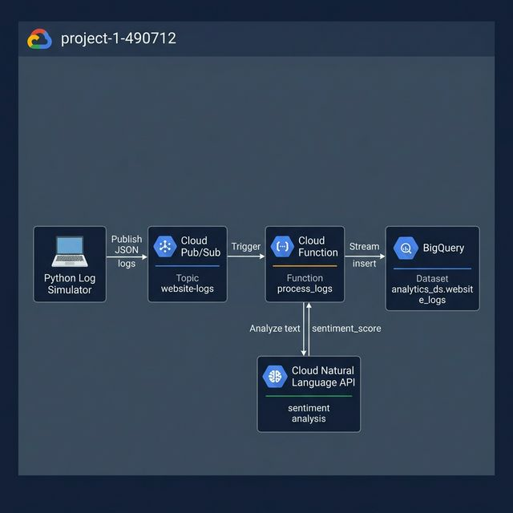

# Intelligent Cloud-Based Log Analytics & BI System

> **Course:** CSC11006 - Introduction to Cloud Computing  
> **Project:** 1 — Intelligent Cloud-Based Log Analytics & BI System  
> **GCP Project ID:** `project-1-490712`

## System Architecture

```
Python Simulator → Cloud Pub/Sub → Cloud Function → NLP API → BigQuery → Looker Studio
                   (website-logs)   (process_logs)  (sentiment)  (analytics_ds)
```



---

## Project Status

| Phase | Description | Status | Owner |
|-------|-------------|--------|-------|
| Phase 1 | Environment & Security Setup | ✅ Done | Binh Duy |
| Phase 2 | Data Ingestion (Pub/Sub) | ✅ Done | Binh Duy |
| Phase 3 | Intelligent Processing (Cloud Function + AI) | ✅ Done | Binh Duy |
| Phase 4 | Predictive Analytics (BigQuery ML) | ⬜ TODO | Partner |
| Phase 5 | Visualization (Looker Studio) | ⬜ TODO | Partner |
| Report | Final Report | ⬜ TODO | Partner |

---

## Folder Structure

```
├── simulator/
│   ├── simulator.py          # Python Log Simulator (Appendix A)
│   └── requirements.txt      # google-cloud-pubsub
├── cloud_function/
│   ├── main.py               # Cloud Function: Pub/Sub → NLP → BigQuery
│   └── requirements.txt      # google-cloud-language, google-cloud-bigquery
├── screenshots/
│   ├── 01_PubSub_Topic.png
│   ├── 02_Cloud_Function_Deployment.png
│   ├── 03_BigQuery_Table_Data.png
│   ├── 04_Architecture_Diagram.png
│   └── 05_Extra_SQL_Analysis.png
└── README.md
```

---

## How It Works

### Phase 2 — Simulator (`simulator/simulator.py`)
Generates fake website traffic logs and publishes them to Pub/Sub topic `website-logs`.  
Each log contains: `user_id`, `action`, `page`, `response_time_ms`, and `feedback` (30% chance).

### Phase 3 — Cloud Function (`cloud_function/main.py`)
Triggered automatically by Pub/Sub. For each message it:
1. Decodes and parses the JSON log
2. Checks if `feedback` exists
3. If yes → calls **Google Cloud Natural Language API** for `sentiment_score` (-1.0 to 1.0)
4. Inserts the enriched record into **BigQuery** (`analytics_ds.website_logs`)

---

## For Partner: Phase 4 & 5 Instructions

### Phase 4 — BigQuery ML (Predictive Analytics)
Run this SQL in BigQuery to train a Logistic Regression model:

```sql
CREATE OR REPLACE MODEL `analytics_ds.purchase_prediction`
OPTIONS(
  model_type='logistic_reg',
  input_label_cols=['is_purchase']
) AS

SELECT
  IF(action='purchase',1,0) AS is_purchase,
  sentiment_score,
  response_time_ms
FROM `analytics_ds.website_logs`
WHERE sentiment_score IS NOT NULL;
```

Then test predictions with:
```sql
SELECT * FROM ML.PREDICT(MODEL `analytics_ds.purchase_prediction`,
  (SELECT sentiment_score, response_time_ms 
   FROM `analytics_ds.website_logs` 
   WHERE sentiment_score IS NOT NULL 
   LIMIT 10)
);
```

### Phase 5 — Looker Studio (Visualization)
1. Go to [lookerstudio.google.com](https://lookerstudio.google.com)
2. Create a Blank Report → Add Data Source → BigQuery → `analytics_ds.website_logs`
3. Create these charts:
   - **Gauge Chart:** `AVG(sentiment_score)` range 0 to 1
   - **Time Series:** `COUNT(user_id)` by `timestamp` (traffic per hour)
   - **Pie Chart:** `COUNT(action)` by `action` (action distribution)

---

## GCP Services Used
- Cloud Pub/Sub
- Cloud Functions (Gen2)
- Cloud Natural Language API
- BigQuery + BigQuery ML
- Looker Studio
